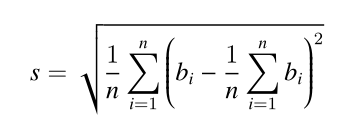

* content
{:toc}

> 试题+个人答案。 二等奖，所以答案肯定有错的或算法效率不够高。
<br>聊以记录。

<!-- more -->

前4题未保存代码，简述思路。


## 分数

`1/1 + 1/2 + 1/4 + 1/8 + 1/16 + ....` 每项是前一项的一半，如果一共有20项,求这个和是多少，结果用分数表示出来。

类似：`	3/2` 。当然，这只是加了前2项而已。分子分母要求互质。

注意：

	需要提交的是已经约分过的分数，中间任何位置不能含有空格。
	请不要填写任何多余的文字或符号。

思路： 很简单的加和题，基本可以目测答案。 另外这种形式的加和结果一定互质，所以可以省去约分过程。

答案： `(2^20-1)/2^19`

## 星期一

整个20世纪（1901年1月1日至2000年12月31日之间），一共有多少个星期一？(不要告诉我你不知道今天是星期几)

注意：

	需要提交的只是一个整数，不要填写任何多余的内容或说明文字。

思路： 找出今天星期几，然后推出2000-12-31是星期几，最后算出整个20世纪一共多少天，除7即可。

答案： `5217`

## 乘积尾零

如下的10行数据，每行有10个整数，请你求出它们的乘积的末尾有多少个零？
| | | | | | | | | | | 
|:--|:--|:--|:--|:--|:--|:--|:--|:--|:--|
|5650| 4542| 3554| 473| 946| 4114| 3871| 9073| 90| 4329| 
|2758|7949|6113|5659|5245|7432|3051|4434|6704|3594|
|9937|1173|6866|3397|4759|7557|3070|2287|1453|9899|
|1486|5722|3135|1170|4014|5510|5120|729|2880|9019|
|2049|698|4582|4346|4427|646|9742|7340|1230|7683|
|5693|7015|6887|7381|4172|4341|2909|2027|7355|5649|
|6701|6645|1671|5978|2704|9926|295|3125|3878|6785|
|2066|4247|4800|1578|6652|4616|1113|6205|3264|2915|
|3966|5291|2904|1285|2193|1428|2265|8730|9436|7074|
|689|5510|8243|6114|337|4096|8199|7313|3685|211|

注意： 需要提交的是一个整数，表示末尾零的个数。不要填写任何多余内容。

思路： 当时是直接逐个乘的。对每一步得出的结果，如果结尾是0，则计数，并且去掉结尾的0，最后余100000000，保证不溢出。

答案： 31

## 第几个幸运数
到x星球旅行的游客都被发给一个整数，作为游客编号。x星的国王有个怪癖，他只喜欢数字3,5和7。国王规定，游客的编号如果只含有因子：3,5,7,就可以获得一份奖品。

我们来看前10个幸运数字是：
```
3 5 7 9 15 21 25 27 35 45
```
因而第11个幸运数字是：49

小明领到了一个幸运数字 59084709587505，他去领奖的时候，人家要求他准确地说出这是第几个幸运数字，否则领不到奖品。

请你帮小明计算一下，59084709587505是第几个幸运数字。

注意： 需要提交的是一个整数，请不要填写任何多余内容。

思路： 动态规划问题。第i个数是前面i-1个数乘3（或5或7）中的最小值。算法复杂度：O(n^2)。

代码：
```c++
#include<iostream>
using namespace std;
#define LENGTH 10000

long long a[LENGTH];     // 注意：这里必须用long long

//第n个位置上的最小值 
long long min(int n){
	long long ans=59084709587509; //只要这个数大于目标值就好
	long long  flag=a[n-1];
	for(int i=0;i<n;i++){
		long long t=a[i]*3;
		if(t>flag&&t<ans) ans=t;
		t=a[i]*5;
		if(t>flag&&t<ans) ans=t;
		t=a[i]*7;
		if(t>flag&&t<ans) ans=t;
	}
	return ans;
}

int main(){
	a[0]=3,a[1]=5,a[2]=7;
	for(int i=3;i<LENGTH;i++){
		a[i]=min(i);
		if(a[i]==59084709587505) {
			cout<<i<<endl;
			break;
		}
	}
	return 0;
}
```

答案： 1905

## 打印图形

如下的程序会在控制台绘制分形图（就是整体与局部自相似的图形）。

当n=1,2,3的时候，输出如下：
请仔细分析程序，并填写划线部分缺少的代码。

n=1时：
```
 o 
ooo
 o 
```

n=2时：
```
    o    
   ooo   
    o    
 o  o  o 
ooooooooo
 o  o  o 
    o    
   ooo   
    o    
```

n=3时：
```
             o             
            ooo            
             o             
          o  o  o          
         ooooooooo         
          o  o  o          
             o             
            ooo            
             o             
    o        o        o    
   ooo      ooo      ooo   
    o        o        o    
 o  o  o  o  o  o  o  o  o 
ooooooooooooooooooooooooooo
 o  o  o  o  o  o  o  o  o 
    o        o        o    
   ooo      ooo      ooo   
    o        o        o    
             o             
            ooo            
             o             
          o  o  o          
         ooooooooo         
          o  o  o          
             o             
            ooo            
             o             
```

源程序：

```c
#include <stdio.h>
#include <stdlib.h>

void show(char* buf, int w){
	int i,j;
	for(i=0; i<w; i++){
		for(j=0; j<w; j++){
			printf("%c", buf[i*w+j]==0? ' ' : 'o');
		}
		printf("\n");
	}
}

void draw(char* buf, int w, int x, int y, int size){
	if(size==1){
		buf[y*w+x] = 1;
		return;
	}
	
	int n = _________________________ ; //填空
	draw(buf, w, x, y, n);
	draw(buf, w, x-n, y ,n);
	draw(buf, w, x+n, y ,n);
	draw(buf, w, x, y-n ,n);
	draw(buf, w, x, y+n ,n);
}

int main()
{
	int N = 3;
	int t = 1;
	int i;
	for(i=0; i<N; i++) t *= 3;
	
	char* buf = (char*)malloc(t*t);
	for(i=0; i<t*t; i++) buf[i] = 0;
	
	draw(buf, t, t/2, t/2, t);
	show(buf, t);
	free(buf);
	
	return 0;
}
```

注意： 只提交划线部分缺少的代码，不要抄写任何已经存在的代码或符号。

答案：`size/3`

## 航班时间

### 问题背景
小h前往美国参加了蓝桥杯国际赛。小h的女朋友发现小h上午十点出发，上午十二点到达美国，于是感叹到“现在飞机飞得真快，两小时就能到美国了”。

小h对超音速飞行感到十分恐惧。仔细观察后发现飞机的起降时间都是当地时间。由于北京和美国东部有12小时时差，故飞机总共需要14小时的飞行时间。

不久后小h的女朋友去中东交换。小h并不知道中东与北京的时差。但是小h得到了女朋友来回航班的起降时间。小h想知道女朋友的航班飞行时间是多少。

### 问题描述
对于一个可能跨时区的航班，给定来回程的起降时间。假设飞机来回飞行时间相同，求飞机的飞行时间。

### 输入格式
从标准输入读入数据。
一个输入包含多组数据。

输入第一行为一个正整数T，表示输入数据组数。
每组数据包含两行，第一行为去程的 起降 时间，第二行为回程的 起降 时间。

起降时间的格式如下
```
h1:m1:s1 h2:m2:s2
```
或
```
h1:m1:s1 h3:m3:s3 (+1)
```
或
```
h1:m1:s1 h4:m4:s4 (+2)
```
表示该航班在当地时间h1时m1分s1秒起飞，

第一种格式表示在当地时间 当日 h2时m2分s2秒降落

第二种格式表示在当地时间 次日 h3时m3分s3秒降落。

第三种格式表示在当地时间 第三天 h4时m4分s4秒降落。

对于此题目中的所有以 h:m:s 形式给出的时间, 保证 ( 0<=h<=23, 0<=m,s<=59 ).

### 输出格式
输出到标准输出。

对于每一组数据输出一行一个时间`hh:mm:ss`，表示飞行时间为hh小时mm分ss秒。
注意，当时间为一位数时，要补齐前导零。如三小时四分五秒应写为`03:04:05`。

### 样例输入
```
3
17:48:19 21:57:24
11:05:18 15:14:23
17:21:07 00:31:46 (+1)
23:02:41 16:13:20 (+1)
10:19:19 20:41:24
22:19:04 16:41:09 (+1)
```

### 样例输出
```
04:09:05
12:10:39
14:22:05
```
### 限制与约定
保证输入时间合法，飞行时间不超过24小时。

资源约定：
	
	峰值内存消耗（含虚拟机） < 256M
	CPU消耗  < 1000ms


请严格按要求输出，不要画蛇添足地打印类似：“请您输入...” 的多余内容。

注意：

	main函数需要返回0;
	只使用ANSI C/ANSI C++ 标准;
	不要调用依赖于编译环境或操作系统的特殊函数。
	所有依赖的函数必须明确地在源文件中 #include <xxx>
	不能通过工程设置而省略常用头文件。

提交程序时，注意选择所期望的语言类型和编译器类型。

思路： 很简单的一道题，就是处理输入格式时不要复杂化。直接用sscanf就可以处理。

代码：
```c
#include<stdio.h>

int main(){
	int n;
	scanf("%d\n",&n);
	char tmp[100];
	int h1,m1,s1,h2,m2,s2;
	int d=0;
	for(int i=0;i<n;i++){
		for(int i=0;i<100;i++) tmp[i]=0;
		d=0;
		gets(tmp);		
		sscanf(tmp,"%d:%d:%d %d:%d:%d (+%d)",&h1,&m1,&s1,&h2,&m2,&s2,&d);
		long t1=s1+m1*60+h1*60*60;
		long t2=s2+m2*60+(h2+24*d)*60*60;
		long tt1=t2-t1;
		
		for(int i=0;i<100;i++) tmp[i]=0;
		d=0;
		gets(tmp);
		sscanf(tmp,"%d:%d:%d %d:%d:%d (+%d)",&h1,&m1,&s1,&h2,&m2,&s2,&d);
		t1=s1+m1*60+h1*60*60;
		t2=s2+m2*60+(h2+24*d)*60*60;
		long tt2=t2-t1;
		
		long t=(tt1+tt2)/2;
				
		int h,m,s;
		s=t%60; t/=60;
		m=t%60; t/=60;
		h=t;
		printf("%02d:%02d:%02d\n",h,m,s);
	}
	return 0;
}
```

## 三体攻击

### 题目描述
三体人将对地球发起攻击。为了抵御攻击，地球人派出了 A × B × C 艘战舰，在太空中排成一个 A 层 B 行 C 列的立方体。其中，第 i 层第 j 行第 k 列的战舰（记为战舰 (i, j, k)）的生命值为 d(i, j, k)。

三体人将会对地球发起 m 轮“立方体攻击”，每次攻击会对一个小立方体中的所有战舰都造成相同的伤害。具体地，第 t 轮攻击用 7 个参数 lat, rat, lbt, rbt, lct, rct, ht 描述；
所有满足 i ∈ [lat, rat],j ∈ [lbt, rbt],k ∈ [lct, rct] 的战舰 (i, j, k) 会受到 ht 的伤害。如果一个战舰累计受到的总伤害超过其防御力，那么这个战舰会爆炸。

地球指挥官希望你能告诉他，第一艘爆炸的战舰是在哪一轮攻击后爆炸的。

### 输入格式
从标准输入读入数据。

第一行包括 4 个正整数 A, B, C, m；

第二行包含 A × B × C 个整数，其中第 ((i − 1)×B + (j − 1)) × C + (k − 1)+1 个数为 d(i, j, k)；

第 3 到第 m + 2 行中，第 (t − 2) 行包含 7 个正整数 lat, rat, lbt, rbt, lct, rct, ht。

### 输出格式
输出到标准输出。

输出第一个爆炸的战舰是在哪一轮攻击后爆炸的。保证一定存在这样的战舰。

### 样例输入
```
2 2 2 3
1 1 1 1 1 1 1 1
1 2 1 2 1 1 1
1 1 1 2 1 2 1
1 1 1 1 1 1 2
```

### 样例输出
```
2
```
### 样例解释
在第 2 轮攻击后，战舰 (1,1,1) 总共受到了 2 点伤害，超出其防御力导致爆炸。

### 数据约定
对于 10% 的数据，B = C = 1；
对于 20% 的数据，C = 1；
对于 40% 的数据，A × B × C, m ≤ 10, 000；
对于 70% 的数据，A, B, C ≤ 200；
对于所有数据，A × B × C ≤ 10^6, m ≤ 10^6, 0 ≤ d(i, j, k), ht ≤ 10^9。

资源约定：

	峰值内存消耗（含虚拟机） < 256M
	CPU消耗  < 2000ms


请严格按要求输出，不要画蛇添足地打印类似：“请您输入...” 的多余内容。

注意：

	main函数需要返回0;
	只使用ANSI C/ANSI C++ 标准;
	不要调用依赖于编译环境或操作系统的特殊函数。
	所有依赖的函数必须明确地在源文件中 #include <xxx>
	不能通过工程设置而省略常用头文件。

提交程序时，注意选择所期望的语言类型和编译器类型。

思路： 这题没想到比较好的方法，直接用暴力解的。

代码：
```c++
#include<iostream>
using namespace std;

int main(){
	int A,B,C,m;
	int ans=0,flag=1;
	cin>>A>>B>>C>>m;
	int	h[A*B*C];
	for(int i=0;i<A*B*C;i++) cin>>h[i];
	
	int lat,rat,lbt,rbt,lct,rct,ht;
	for(int rank=0;rank<m;rank++){
		cin>>lat>>rat>>lbt>>rbt>>lct>>rct>>ht;
		if(flag==0) continue;
		for(int i=lat;i<=rat;i++){
			for(int j=lbt;j<=rbt;j++){
				for(int k=lct;k<=rct;k++){
					h[((i-1)*B+(j-1))*C+k-1]-=ht;
					if(h[((i-1)*B+(j-1))*C+k-1]<0){
						ans=rank+1;
						flag=0;
					}
				}
			}
		}
	}
	
	cout<<ans;
	
	return 0;
}
```

## 全球变暖

### 题目描述
你有一张某海域NxN像素的照片，"."表示海洋、"#"表示陆地，如下所示：
```
.......
.##....
.##....
....##.
..####.
...###.
.......
```

其中"上下左右"四个方向上连在一起的一片陆地组成一座岛屿。例如上图就有2座岛屿。  

由于全球变暖导致了海面上升，科学家预测未来几十年，岛屿边缘一个像素的范围会被海水淹没。具体来说如果一块陆地像素与海洋相邻(上下左右四个相邻像素中有海洋)，它就会被淹没。  

例如上图中的海域未来会变成如下样子：
```
.......
.......
.......
.......
....#..
.......
.......
```
请你计算：依照科学家的预测，照片中有多少岛屿会被完全淹没。  

### 输入格式
第一行包含一个整数N。  (1 <= N <= 1000)  
以下N行N列代表一张海域照片。  

照片保证第1行、第1列、第N行、第N列的像素都是海洋。  

### 输出格式
一个整数表示答案。

### 样例输入
```
7 
.......
.##....
.##....
....##.
..####.
...###.
.......  
```
### 样例输出
```
1  
```

资源约定：

	峰值内存消耗（含虚拟机） < 256M
	CPU消耗  < 1000ms


请严格按要求输出，不要画蛇添足地打印类似：“请您输入...” 的多余内容。

提交程序时，注意选择所期望的语言类型和编译器类型。

思路：见代码
```c++
#include<iostream>
using namespace std;

int A[1000][1000];   //0表示海洋，1表示沿海陆地，2表示内陆 
int B[1000][1000];

void clear(int a[][1000],int m,int n){
	a[m][n]=0;
	if(a[m-1][n]) clear(a,m-1,n);
	if(a[m+1][n]) clear(a,m+1,n);
	if(a[m][n-1]) clear(a,m,n-1);
	if(a[m][n+1]) clear(a,m,n+1);
}


int main(){
	int N;
	cin>>N;
	char tmp;
	for(int i=0;i<N;i++){
		for(int j=0;j<N;j++){
			cin>>tmp;
			if(tmp=='.') A[i][j]=0;
			else if(tmp=='#') A[i][j]=1;
			B[i][j]=A[i][j];   
		}
	}
	
	int num1=0,num2=0;
	
	//求num1
	for(int i=0;i<N;i++){
		for(int j=0;j<N;j++){
			if(B[i][j]==1){
				num1++;
				clear(B,i,j);   //把相连的清理干净 
			}
		}
	} 
	
//	cout<<"NUM1:"<<num1<<endl;
	
	//找出内陆
	for(int i=0;i<N;i++){
		for(int j=0;j<N;j++){
			if(A[i][j]==1){
				if(A[i-1][j]==1 && A[i+1][j]==1 && A[i][j+1]==1 && A[i][j-1]==1) 
					A[i][j]=2;
			}
		}
	} 
	
	for(int i=0;i<N;i++){
		for(int j=0;j<N;j++){
			if(A[i][j]==1) A[i][j]=0;
		}
	}
	
	for(int i=0;i<N;i++){
		for(int j=0;j<N;j++){
			if(A[i][j]==2){
				num2++;
				clear(A,i,j);   //把相连的清理干净 
			}
		}
	} 
	
//	cout<<"NUM2:"<<num2<<endl;
	cout<<num1-num2;
	return 0;
}
```

## 
标题：倍数问题

### 题目描述
众所周知，小葱同学擅长计算，尤其擅长计算一个数是否是另外一个数的倍数。但小葱只擅长两个数的情况，当有很多个数之后就会比较苦恼。现在小葱给了你 n 个数，希望你从这 n 个数中找到三个数，使得这三个数的和是 K 的倍数，且这个和最大。数据保证一定有解。

### 输入格式
从标准输入读入数据。

第一行包括 2 个正整数 n, K。

第二行 n 个正整数，代表给定的 n 个数。

### 输出格式
输出到标准输出。

输出一行一个整数代表所求的和。

### 样例入
```
4 3
1 2 3 4
```
### 样例输出
```
9
```
### 样例解释
选择2、3、4。

### 数据约定
```
对于 30% 的数据，n <= 100。
对于 60% 的数据，n <= 1000。
对于另外 20% 的数据，K <= 10。
对于 100% 的数据，1 <= n <= 10^5, 1 <= K <= 10^3，给定的 n 个数均不超过 10^8。
```

资源约定：
	
	峰值内存消耗（含虚拟机） < 256M
	CPU消耗  < 1000ms


请严格按要求输出，不要画蛇添足地打印类似：“请您输入...” 的多余内容。

提交程序时，注意选择所期望的语言类型和编译器类型。

代码：
```c++
#include<iostream>
#include<stdlib.h>
using namespace std;

int compare(const void* a,const void* b){
	if(*(int*)a<*(int*)b)  return 1;
	return 0;
}

int main(){
	int n,K;
	cin>>n>>K;
	
	int a[n];
	for(int i=0;i<n;i++) cin>>a[i];
	qsort(a,n,sizeof(int),compare);
	
	for(int i=0;i<n;i++){
		for(int j=i+1;j<n;j++){
			for(int k=j+1;k<n;k++){
				int sum=a[i]+a[j]+a[k];
				if(sum%K==0){
					cout<<sum;
					return 0;
				}
			}
		}
	}
		
	return 0;
}
```

## 付账问题

### 题目描述
几个人一起出去吃饭是常有的事。但在结帐的时候，常常会出现一些争执。

现在有 n 个人出去吃饭，他们总共消费了 S 元。其中第 i 个人带了 ai 元。幸运的是，所有人带的钱的总数是足够付账的，但现在问题来了：每个人分别要出多少钱呢？

为了公平起见，我们希望在总付钱量恰好为 S 的前提下，最后每个人付的钱的标准差最小。这里我们约定，每个人支付的钱数可以是任意非负实数，即可以不是1分钱的整数倍。你需要输出最小的标准差是多少。

> 标准差的介绍：标准差是多个数与它们平均数差值的平方平均数，一般用于刻画这些数之间的“偏差有多大”。形式化地说，设第 i 个人付的钱为 bi 元，那么标准差为 :

### 输入格式
从标准输入读入数据。

第一行包含两个整数 n、S；

第二行包含 n 个非负整数 a1, ..., an。

### 输出格式
输出到标准输出。

输出最小的标准差，四舍五入保留 4 位小数。

保证正确答案在加上或减去 10^−9 后不会导致四舍五入的结果发生变化。

### 样例1输入
```
5 2333
666 666 666 666 666
```
### 样例输出
```
0.0000
```
### 样例解释
每个人都出 2333/5 元，标准差为 0。

再比如：
### 样例输入
```
10 30
2 1 4 7 4 8 3 6 4 7
```
### 样例输出
```
0.7928
```
### 数据说明
```
对于 10% 的数据，所有 ai 相等；
对于 30% 的数据，所有非 0 的 ai 相等；
对于 60% 的数据，n ≤ 1000；
对于 80% 的数据，n ≤ 10^5；
对于所有数据，n ≤ 5 × 10^5, 0 ≤ ai ≤ 10^9。
```

资源约定：

	峰值内存消耗（含虚拟机） < 256M
	CPU消耗  < 1000ms


请严格按要求输出，不要画蛇添足地打印类似：“请您输入...” 的多余内容。

提交程序时，注意选择所期望的语言类型和编译器类型。

代码：
```c++
#include<stdio.h>
#include<math.h>
#include<stdlib.h>

int main(){
	int n;
	double S;
	scanf("%d%lf",&n,&S);
	int a[n];
	for(int i=0;i<n;i++) scanf("%d",&a[i]);
	
	double b[n];
	for(int i=0;i<n;i++) b[i]=0;
	
	int num=n;
	double leftOfS=S;
	double aaaa=0;
	while(aaaa+10e-4<S){
		double t=leftOfS/num;
		for(int i=0;i<n;i++){
			if(a[i]<=t){
				b[i]=a[i];
				leftOfS-=b[i];
				num-=1;
			}
			else{
				b[i]=t;
			}
		}
		
		for(int i=0;i<n;i++) aaaa+=b[i];
	}
	
	double ans=0;
	double f=S/n;
	for(int i=0;i<n;i++){
		double tmp=b[i]-f;
		tmp*=tmp;
		ans+=tmp;
	}
	ans/=n;
	ans=sqrt(ans);
	
	printf("%.4f",ans);
	
	return 0;
}

```
